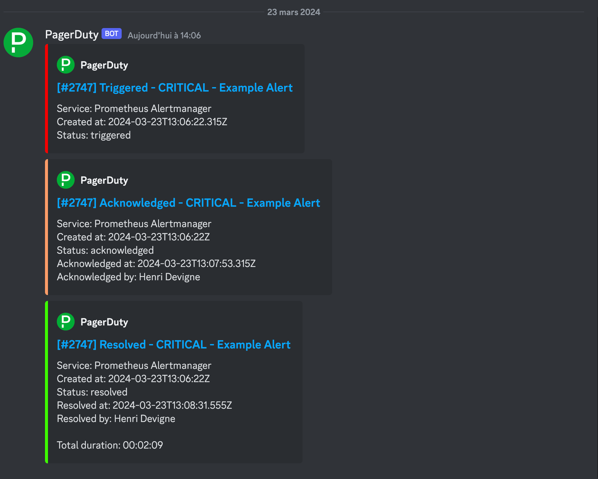

# PagerDuty to Discord

This repository permit to convert PagerDuty webhook v3 into Discord webhook

## Usage

1. Just place this code into a webserver or use the `henri9813/pagerduty-to-discord` docker image
2. Retrieve a webhook url from Discord
3. In PagerDuty, configure a webhook, and replace the domain name "discord.com" by your website url.

    Before: `https://discord.com/api/webhooks/1221035950939963412/JUys_fJ92NvV8vxDSDsMP_BsUjPEUxiLyz8hxN-cXT4rvc2kolRVOapti2YXqcOUV7gP` 

    After: `https://my-pagerduty-to-discord.com/api/webhooks/1221035950939963412/JUys_fJ92NvV8vxDSDsMP_BsUjPEUxiLyz8hxN-cXT4rvc2kolRVOapti2YXqcOUV7gP`
4. Have fun

## Requirements

- PHP: >= 8.0.9 ( from dependency )

## Screenshots

## Licence

Creative Commons Attribution-NonCommercial 4.0 International License
